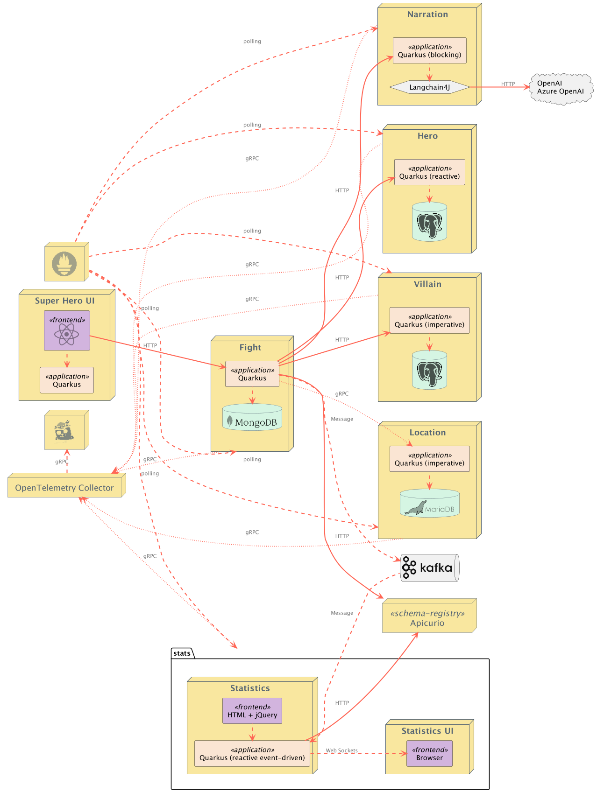

# Quarkus Super-Heroes Sample Application

This is a sample application demonstrating Quarkus capabilities in a microservices architecture. The application consists of several microservices that work together to enable superheroes and supervillains to fight each other.

## Table of Contents

- [Overview](#overview)
- [Architecture](#architecture)
- [Microservices](#microservices)
- [Quick Start](#quick-start)
- [Running the Application](#running-the-application)
- [Deployment Options](#deployment-options)
- [Documentation](#documentation)
- [Contributing](#contributing)
- [License](#license)

## Overview

The Quarkus Super-Heroes application is a comprehensive example of a microservices-based system built with [Quarkus](https://quarkus.io), the Supersonic Subatomic Java Framework. It showcases:

- Reactive and imperative programming models
- REST and gRPC communication
- Event-driven architecture with Apache Kafka
- Database integration (PostgreSQL, MongoDB, MariaDB)
- AI integration for fight narration
- Observability with OpenTelemetry, Prometheus, and Jaeger
- Contract testing with Pact
- Cloud-native deployment (Kubernetes, OpenShift, Azure Container Apps)

## Architecture

The application consists of multiple microservices that communicate with each other to orchestrate superhero battles:



### System Components

- **Fight Service**: Orchestrates battles between heroes and villains
- **Hero Service**: Manages superhero data
- **Villain Service**: Manages supervillain data
- **Narration Service**: Generates AI-powered fight narrations using OpenAI
- **Location Service**: Provides fight locations via gRPC
- **Statistics Service**: Collects and displays fight statistics in real-time
- **UI**: Angular-based web interface for the application

## Microservices

### [Rest Fights](rest-fights)

The main service that orchestrates fights between heroes and villains. It's a reactive HTTP microservice that:
- Fetches random heroes and villains
- Determines fight locations
- Generates AI-powered narrations
- Publishes fight results to Kafka
- Stores fights in MongoDB

**Tech Stack**: Quarkus, RESTEasy Reactive, MongoDB Reactive with Panache, Apache Kafka, Avro

### [Rest Heroes](rest-heroes)

Manages the hero roster with full CRUD operations. A reactive HTTP microservice featuring:
- RESTEasy Reactive endpoints
- PostgreSQL database with Hibernate Reactive
- Panache repository pattern

**Tech Stack**: Quarkus, RESTEasy Reactive, PostgreSQL, Hibernate Reactive with Panache

### [Rest Villains](rest-villains)

Handles villain data with comprehensive REST API. An imperative HTTP microservice with:
- JAX-RS endpoints
- PostgreSQL database with Hibernate ORM
- Full CRUD operations

**Tech Stack**: Quarkus, JAX-RS, PostgreSQL, Hibernate ORM with Panache

### [Rest Narration](rest-narration)

Generates creative fight narrations using AI. Integrates with:
- Azure OpenAI
- OpenAI API
- LangChain4j for AI orchestration

**Tech Stack**: Quarkus, RESTEasy Reactive, LangChain4j, OpenAI/Azure OpenAI

### [gRPC Locations](grpc-locations)

Provides fight locations via gRPC protocol, showcasing:
- gRPC service implementation
- MariaDB database integration
- Protocol Buffers

**Tech Stack**: Quarkus, gRPC, MariaDB, Hibernate ORM with Panache

### [Event Statistics](event-statistics)

Real-time statistics dashboard that:
- Consumes fight events from Kafka
- Displays statistics via Server-Sent Events (SSE)
- Processes Avro-encoded messages

**Tech Stack**: Quarkus, Apache Kafka, Avro, Server-Sent Events

### [UI Super-Heroes](ui-super-heroes)

Web-based user interface featuring:
- Angular frontend
- Quarkus backend for serving static content
- Real-time fight animations

**Tech Stack**: Angular, Quarkus, WebSockets

## Quick Start

### Prerequisites

- Java 21+
- Maven 3.9+
- Docker and Docker Compose (for local deployment)
- Kubernetes/Minikube/OpenShift (for container deployment)

### Running Locally with Docker Compose

The fastest way to run the entire system:

```bash
# From the project root
cd deploy/docker-compose
docker compose -f java21.yml up
```

Access the application at http://localhost:8080

### Running Individual Services

Each microservice can run independently in dev mode:

```bash
# Example: Running the Heroes service
cd rest-heroes
./mvnw quarkus:dev
```

The service will be available at http://localhost:8083 with the Quarkus Dev UI at http://localhost:8083/q/dev

## Deployment Options

### Docker Compose

Pre-configured Docker Compose files for different scenarios:

- **[java21.yml](deploy/docker-compose/java21.yml)**: Full system with Java 21 JVM images
- **[native.yml](deploy/docker-compose/native.yml)**: Full system with native compiled images
- **[monitoring.yml](deploy/docker-compose/monitoring.yml)**: Observability stack (Prometheus, Jaeger, OpenTelemetry)

### Kubernetes

Deploy to Kubernetes using pre-built manifests:

```bash
kubectl apply -f deploy/k8s/java21-kubernetes.yml
```

Available manifest types:
- **kubernetes.yml**: Standard Kubernetes deployment
- **minikube.yml**: Minikube-optimized deployment
- **openshift.yml**: OpenShift-specific deployment
- **knative.yml**: Knative serverless deployment

### Azure Container Apps

Deploy to Azure using the provided automation script:

```bash
./scripts/deploy-to-azure-containerapps.sh
```

See [Azure Container Apps deployment guide](docs/deploying-to-azure-containerapps.md) for details.

## Documentation

### Core Documentation

- **[Automation Guide](docs/automation.md)**: CI/CD workflows and resource generation
- **[Azure Deployment](docs/deploying-to-azure-containerapps.md)**: Deploying to Azure Container Apps
- **[Contributing Guide](CONTRIBUTING.md)**: How to contribute to the project

### Service-Specific Documentation

Each microservice has detailed documentation in its respective directory:

- [Rest Fights Documentation](rest-fights/README.md)
- [Rest Heroes Documentation](rest-heroes/README.md)
- [Rest Villains Documentation](rest-villains/README.md)
- [Rest Narration Documentation](rest-narration/README.md)
- [gRPC Locations Documentation](grpc-locations/README.md)
- [Event Statistics Documentation](event-statistics/README.md)
- [UI Documentation](ui-super-heroes/README.md)

### Additional Resources

- [Scripts Documentation](scripts/README.md): Utility scripts for deployment and testing
- [JMeter Load Testing](scripts/jmeter/README.md): Performance testing setup

## Features Demonstrated

### Quarkus Features

- **Dev Mode**: Live reload during development
- **Dev UI**: Interactive development console
- **Extensions**: Leveraging 100+ Quarkus extensions
- **Native Compilation**: GraalVM native image support
- **Container First**: Optimized for containers and Kubernetes

### Microservices Patterns

- **Service Communication**: REST, gRPC, and async messaging
- **Resilience**: Timeouts, retries, fallbacks, circuit breakers
- **Event-Driven**: Apache Kafka with Avro schema registry
- **Observability**: Distributed tracing, metrics, and logging
- **Contract Testing**: Pact consumer-driven contracts

### Cloud-Native

- **Container Images**: JVM and native builds
- **Multi-arch Support**: AMD64 and ARM64 images
- **Kubernetes Ready**: Helm charts and manifests included
- **Service Mesh**: Istio/Linkerd compatible
- **Serverless**: Knative deployment support

## Technology Stack

- **Framework**: [Quarkus](https://quarkus.io)
- **Languages**: Java 21, TypeScript/JavaScript
- **Databases**: PostgreSQL, MongoDB, MariaDB
- **Messaging**: Apache Kafka with Avro
- **AI/ML**: OpenAI, Azure OpenAI, LangChain4j
- **Observability**: OpenTelemetry, Prometheus, Jaeger
- **Frontend**: Angular
- **Build**: Maven
- **Container**: Docker, Podman

## CI/CD and Automation

The project includes comprehensive GitHub Actions workflows:

- **Build and Test**: Automated testing on every commit
- **Container Images**: Multi-arch image builds (JVM and native)
- **Deployment Resources**: Automatic generation of Kubernetes/Docker Compose manifests
- **Quality Gates**: SonarCloud integration for code quality

See the [automation documentation](docs/automation.md) for details.

## Monitoring and Observability

The application includes a complete observability stack:

- **Metrics**: Prometheus metrics exposed by all services
- **Tracing**: Distributed tracing with OpenTelemetry and Jaeger
- **Logging**: Structured logging with correlation IDs
- **Dashboards**: Pre-configured Grafana dashboards (available in monitoring configurations)

## Performance

The application showcases Quarkus's performance characteristics:

- **Fast Startup**: Sub-second startup times with native images
- **Low Memory**: Minimal memory footprint
- **High Throughput**: Reactive and imperative models for different use cases
- **Efficient**: Small container images (native images < 100MB)

## Contributing

We welcome contributions! Please see our [Contributing Guide](CONTRIBUTING.md) for details on:

- Code of conduct
- Development setup
- Coding guidelines
- Pull request process
- Testing requirements

## License

This project is licensed under the Apache License 2.0 - see the [LICENSE](LICENSE) file for details.

## Community

- **Issues**: [GitHub Issues](https://github.com/quarkusio/quarkus-super-heroes/issues)
- **Quarkus**: [quarkus.io](https://quarkus.io)
- **Discussions**: [GitHub Discussions](https://github.com/quarkusio/quarkus-super-heroes/discussions)

## Acknowledgments

This application is maintained by the Quarkus team and community as a comprehensive example of building cloud-native microservices with Quarkus.

---

**Note**: This is a demonstration application for learning and showcasing Quarkus capabilities. While it follows best practices, it may not include all production considerations for a real-world application.
