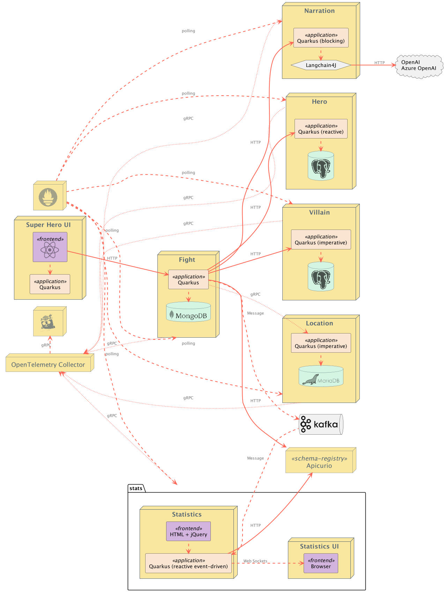

# Quarkus Super-Heroes Documentation

Welcome to the Quarkus Super-Heroes documentation. This guide helps you find the information you need to understand, deploy, and contribute to this microservices demonstration application.

## Documentation Structure

This documentation follows the [Diátaxis framework](https://diataxis.fr/), organizing content into four categories:

- **Tutorials**: Learning-oriented guides to help you get started
- **How-to Guides**: Task-oriented instructions for specific goals
- **Reference**: Technical information and specifications
- **Explanation**: Understanding-oriented discussion of key concepts

## Quick Navigation

### 🚀 Getting Started

New to this project? Start here:

1. **[Main README](../README.md)** - Overview, architecture, and quick start
2. **[Quick Start](#quick-start)** - Get the application running in minutes
3. **[Contributing Guide](../CONTRIBUTING.md)** - How to contribute to the project

### 📚 Tutorials (Learning-Oriented)

- **[Quick Start Guide](#quick-start)** - Run your first superhero battle
- **[Local Development Setup](#local-development-setup)** - Set up your development environment
- Coming soon: Step-by-step tutorial for building a microservice

### 🔧 How-to Guides (Problem-Oriented)

- **[Deploying to Azure Container Apps](deploying-to-azure-containerapps.md)** - Deploy the full stack to Azure
- **[Running with Docker Compose](../deploy/docker-compose)** - Local deployment options
- **[Kubernetes Deployment](../deploy/k8s)** - Deploy to Kubernetes clusters
- **[Monitoring and Observability](monitoring.md)** - Set up metrics, tracing, and logging
- **[Load Testing](../scripts/jmeter/README.md)** - Performance testing with JMeter

### 📖 Reference (Information-Oriented)

- **[API Documentation](#api-documentation)** - REST endpoint specifications
- **[Architecture Overview](#architecture)** - System design and component interactions
- **[CI/CD Automation](automation.md)** - GitHub Actions workflows and resource generation
- **[Configuration Reference](#configuration)** - Environment variables and settings
- **[Technology Stack](#technology-stack)** - Frameworks, tools, and dependencies

### 💡 Explanation (Understanding-Oriented)

- **[Architecture Decisions](#architecture)** - Why we built it this way
- **[Microservices Patterns](#microservices-patterns)** - Patterns demonstrated in this application
- **[Cloud-Native Principles](#cloud-native)** - Container-first, Kubernetes-ready design

## Quick Start

### Prerequisites

- Java 21+
- Maven 3.9+
- Docker and Docker Compose

### Run the Application (Docker Compose)

```bash
cd deploy/docker-compose
docker compose -f java21.yml up
```

Access the application at http://localhost:8080

### Run Individual Services (Dev Mode)

```bash
cd rest-heroes
../mvnw quarkus:dev
```

Dev UI available at http://localhost:8083/q/dev

## Architecture

The application demonstrates a complete microservices architecture:



### Core Services

- **[Rest Fights](../rest-fights/README.md)** - Orchestrates battles between heroes and villains
- **[Rest Heroes](../rest-heroes/README.md)** - Manages superhero data
- **[Rest Villains](../rest-villains/README.md)** - Manages supervillain data
- **[Rest Narration](../rest-narration/README.md)** - AI-powered fight narrations
- **[gRPC Locations](../grpc-locations/README.md)** - Provides fight locations via gRPC
- **[Event Statistics](../event-statistics/README.md)** - Real-time fight statistics
- **[UI Super-Heroes](../ui-super-heroes/README.md)** - Angular web interface

## Local Development Setup

### Development Tools

- **Quarkus Dev Mode**: Live reload for rapid development
- **Quarkus Dev UI**: Interactive development console at `/q/dev`
- **Database Tools**: PostgreSQL, MongoDB, MariaDB containers via Docker Compose
- **Kafka**: Apache Kafka with Avro schema registry

### Running Tests

```bash
# Unit and integration tests
./mvnw clean verify

# Native image tests
./mvnw clean verify -Pnative
```

## API Documentation

Each microservice exposes OpenAPI documentation:

- **Heroes API**: http://localhost:8083/q/swagger-ui
- **Villains API**: http://localhost:8084/q/swagger-ui
- **Fights API**: http://localhost:8082/q/swagger-ui
- **Narration API**: http://localhost:8087/q/swagger-ui
- **Statistics**: http://localhost:8085

## Configuration

### Environment Variables

Each service can be configured via environment variables. Common patterns:

```bash
# Database configuration
QUARKUS_DATASOURCE_USERNAME=myuser
QUARKUS_DATASOURCE_PASSWORD=mypassword
QUARKUS_DATASOURCE_JDBC_URL=jdbc:postgresql://localhost:5432/mydb

# Kafka configuration
KAFKA_BOOTSTRAP_SERVERS=localhost:9092

# OpenTelemetry tracing
QUARKUS_OTEL_EXPORTER_OTLP_TRACES_ENDPOINT=http://localhost:4317
```

See individual service READMEs for specific configuration options.

## Microservices Patterns

This application demonstrates several key microservices patterns:

### Communication Patterns

- **Synchronous REST** - HTTP/REST between services
- **Synchronous gRPC** - High-performance RPC for locations service
- **Asynchronous Messaging** - Kafka for event-driven architecture
- **Server-Sent Events (SSE)** - Real-time statistics updates

### Resilience Patterns

- **Timeouts** - Preventing cascade failures
- **Retries** - Automatic retry with backoff
- **Fallbacks** - Graceful degradation
- **Circuit Breakers** - Preventing resource exhaustion

### Data Patterns

- **Database per Service** - Each service owns its data
- **Event Sourcing** - Fight events published to Kafka
- **CQRS** - Separate read/write models in statistics service

### Testing Patterns

- **Contract Testing** - Pact consumer-driven contracts
- **Integration Testing** - Testcontainers for dependencies
- **End-to-End Testing** - Playwright UI tests

## Cloud-Native

### Container Images

- **JVM Images**: Fast startup, moderate memory (~200MB)
- **Native Images**: Sub-second startup, minimal memory (<100MB)
- **Multi-arch**: AMD64 and ARM64 support

### Kubernetes Ready

- **Health Checks**: Liveness and readiness probes
- **Graceful Shutdown**: Proper lifecycle management
- **Resource Limits**: CPU and memory constraints
- **Horizontal Scaling**: Scale based on load

### Deployment Options

- **[Docker Compose](../deploy/docker-compose)** - Local development
- **[Kubernetes](../deploy/k8s)** - Production deployment
- **[OpenShift](../deploy/k8s)** - Red Hat OpenShift
- **[Knative](../deploy/k8s)** - Serverless platform
- **[Azure Container Apps](deploying-to-azure-containerapps.md)** - Fully managed

## Technology Stack

### Frameworks & Libraries

- **[Quarkus](https://quarkus.io)** - Supersonic Subatomic Java Framework
- **[Hibernate Reactive](https://hibernate.org/reactive/)** - Reactive ORM
- **[RESTEasy Reactive](https://quarkus.io/guides/resteasy-reactive)** - Reactive REST
- **[SmallRye Reactive Messaging](https://smallrye.io/smallrye-reactive-messaging/)** - Kafka integration
- **[LangChain4j](https://github.com/langchain4j/langchain4j)** - AI/LLM integration

### Databases

- **PostgreSQL** - Heroes and Villains data
- **MongoDB** - Fights data
- **MariaDB** - Locations data

### Messaging & Events

- **Apache Kafka** - Event streaming
- **Apache Avro** - Schema registry

### Observability

- **OpenTelemetry** - Distributed tracing
- **Prometheus** - Metrics collection
- **Jaeger** - Trace visualization
- **Structured Logging** - JSON logs with correlation IDs

### AI/ML

- **OpenAI** - GPT models for narration
- **Azure OpenAI** - Azure-hosted OpenAI

## Additional Resources

### Scripts and Utilities

- **[Scripts README](../scripts/README.md)** - Deployment and testing utilities
- **[JMeter Load Testing](../scripts/jmeter/README.md)** - Performance testing setup

### CI/CD

- **[Automation Guide](automation.md)** - Detailed CI/CD documentation
- **GitHub Actions** - 20+ workflows for build, test, and deploy

### Community

- **Issues**: [GitHub Issues](https://github.com/quartermaine/quarkus-gh-aw-demo/issues)
- **Discussions**: Share ideas and ask questions
- **Contributing**: See [CONTRIBUTING.md](../CONTRIBUTING.md)

## Troubleshooting

### Common Issues

**Port conflicts**: Ensure ports 8080-8089 are available

```bash
lsof -i :8080
```

**Docker disk space**: Clean up unused images

```bash
docker system prune -a
```

**Memory issues**: Increase Docker memory allocation (8GB+ recommended)

### Getting Help

1. Check service-specific README files
2. Review [GitHub Issues](https://github.com/quartermaine/quarkus-gh-aw-demo/issues)
3. Consult [Quarkus documentation](https://quarkus.io/guides/)
4. Open a new issue with detailed information

## Documentation Maintenance

This documentation is maintained by automated workflows. See the [update-docs workflow](../.github/workflows/update-docs.lock.yml) for details.

**Last updated**: October 2025
