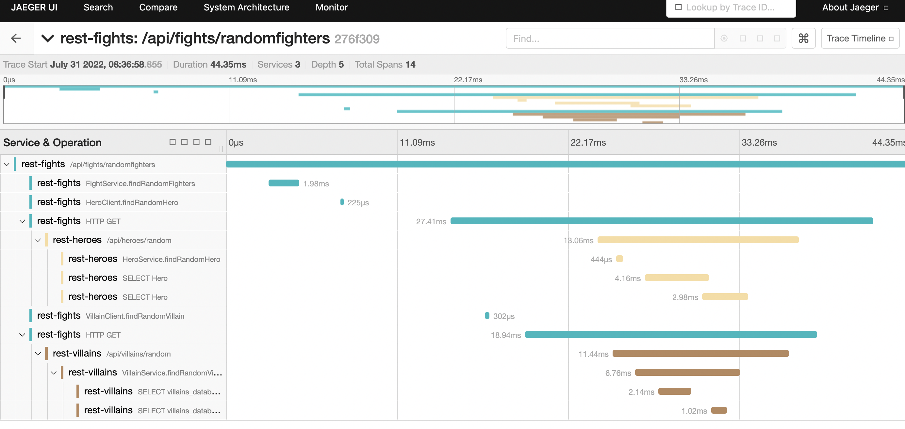

# Monitoring and Observability Guide

This guide explains how to set up and use the monitoring and observability stack for the Quarkus Super-Heroes application.

## Table of Contents

- [Overview](#overview)
- [Quick Start](#quick-start)
- [Metrics with Prometheus](#metrics-with-prometheus)
- [Distributed Tracing with Jaeger](#distributed-tracing-with-jaeger)
- [OpenTelemetry Integration](#opentelemetry-integration)
- [Logging](#logging)
- [Dashboards](#dashboards)
- [Alerting](#alerting)
- [Production Considerations](#production-considerations)

## Overview

The Quarkus Super-Heroes application includes a comprehensive observability stack:

- **Metrics**: Prometheus for collecting and storing metrics
- **Tracing**: Jaeger for distributed tracing visualization
- **Collection**: OpenTelemetry Collector for telemetry data aggregation
- **Logging**: Structured JSON logging with correlation IDs

### Observability Stack Architecture

```
┌─────────────┐     ┌──────────────────┐     ┌────────────┐
│  Services   │────▶│ OTEL Collector   │────▶│ Prometheus │
│  (Metrics)  │     │                  │     └────────────┘
└─────────────┘     └──────────────────┘
                            │
                            │
                            ▼
                    ┌──────────────┐
                    │    Jaeger    │
                    │   (Tracing)  │
                    └──────────────┘
```

## Quick Start

### Running with Docker Compose

The easiest way to start the monitoring stack:

```bash
cd deploy/docker-compose
docker compose -f java21.yml -f monitoring.yml up
```

This starts:
- All microservices
- Prometheus (port 9090)
- Jaeger UI (port 16686)
- OpenTelemetry Collector (ports 4317, 4318)

### Access Monitoring Tools

- **Prometheus**: http://localhost:9090
- **Jaeger UI**: http://localhost:16686
- **Application UI**: http://localhost:8080

### Kubernetes Deployment

For Kubernetes environments, the monitoring stack is included in deployment manifests:

```bash
kubectl apply -f deploy/k8s/java21-kubernetes.yml
```

The monitoring resources are deployed in the same namespace as the application.

## Metrics with Prometheus

### Available Metrics

Each microservice exposes metrics at `/q/metrics`:

#### HTTP Metrics

- `http_server_requests_seconds_count` - Total HTTP requests
- `http_server_requests_seconds_sum` - Total request duration
- `http_server_requests_seconds_max` - Maximum request duration
- Request metrics by status code, method, and URI

#### Application Metrics

- `application_io_quarkus_sample_superheroes_*` - Custom business metrics
- `fights_total` - Total number of fights (Fights service)
- `heroes_created_total` - Heroes created (Heroes service)
- `villains_created_total` - Villains created (Villains service)

#### JVM Metrics

- `jvm_memory_used_bytes` - Memory usage
- `jvm_gc_*` - Garbage collection metrics
- `jvm_threads_*` - Thread pool metrics
- `process_cpu_usage` - CPU utilization

#### Database Metrics

- `hikaricp_connections_*` - Connection pool metrics (JDBC)
- `mongodb_*` - MongoDB client metrics
- `postgresql_*` - PostgreSQL metrics

#### Kafka Metrics

- `kafka_consumer_*` - Consumer metrics
- `kafka_producer_*` - Producer metrics
- Message throughput and lag

### Example Queries

#### Request Rate

```promql
rate(http_server_requests_seconds_count[5m])
```

#### Average Response Time

```promql
rate(http_server_requests_seconds_sum[5m]) / rate(http_server_requests_seconds_count[5m])
```

#### Error Rate

```promql
sum(rate(http_server_requests_seconds_count{status=~"5.."}[5m])) / sum(rate(http_server_requests_seconds_count[5m]))
```

#### Memory Usage

```promql
jvm_memory_used_bytes{area="heap"}
```

### Prometheus Configuration

The Prometheus configuration is located at:
- Docker Compose: `deploy/docker-compose/monitoring/prometheus_scrape_configs.yml`
- Kubernetes: `monitoring/config/prometheus-kubernetes.yml`

Scrape interval is 15 seconds by default.

## Distributed Tracing with Jaeger

### Understanding Traces

A trace represents a complete request flow through the system. Each service interaction creates a span.

Example trace flow:
1. User triggers fight → UI service
2. UI calls Fights service → `/api/fights`
3. Fights calls Heroes service → `/api/heroes/random`
4. Fights calls Villains service → `/api/villains/random`
5. Fights calls Locations service → gRPC call
6. Fights calls Narration service → `/api/narration`
7. Fights publishes event → Kafka
8. Statistics consumes event → Kafka consumer

### Using Jaeger UI

#### Finding Traces

1. Open http://localhost:16686
2. Select a service (e.g., "rest-fights")
3. Click "Find Traces"
4. Filter by:
   - Operation (e.g., "GET /api/fights/randomfighters")
   - Tags (e.g., `http.status_code=200`)
   - Duration (e.g., min duration: 1s for slow requests)

#### Analyzing a Trace



Key information in a trace:
- **Total duration**: End-to-end request time
- **Service calls**: Span for each service interaction
- **Database queries**: Spans for database operations
- **Errors**: Spans with error tags
- **Tags**: Metadata (HTTP method, status, SQL query, etc.)

#### Example: Finding Slow Requests

1. Set minimum duration to 1000ms
2. Look for traces with long durations
3. Identify which span took the most time
4. Check span tags for details (e.g., SQL query, HTTP endpoint)

### Trace Context Propagation

Traces propagate through:
- **HTTP headers**: `traceparent`, `tracestate`
- **Kafka headers**: Automatically propagated
- **gRPC metadata**: Trace context in metadata

## OpenTelemetry Integration

### Configuration

OpenTelemetry is configured in each service's `application.properties`:

```properties
# Enable OpenTelemetry
quarkus.otel.enabled=true

# OTLP exporter (sends to collector)
quarkus.otel.exporter.otlp.traces.endpoint=http://otel-collector:4317

# Service name for traces
quarkus.otel.resource.attributes=service.name=rest-fights

# Sampling (1.0 = 100%)
quarkus.otel.traces.sampler=always_on
```

### OpenTelemetry Collector

The collector aggregates telemetry data from all services:

- Receives traces via OTLP (gRPC on 4317, HTTP on 4318)
- Exports to Jaeger (traces)
- Exposes Prometheus metrics endpoint

Configuration: `deploy/docker-compose/monitoring/otel-collector-config.yml`

### Instrumentation

Automatic instrumentation includes:
- HTTP server and client calls
- Database queries (JDBC, MongoDB)
- Kafka producers and consumers
- gRPC calls
- Reactive streams

Custom spans can be added:

```java
@WithSpan("customOperation")
public void doSomething() {
    // Span automatically created
}
```

## Logging

### Structured Logging

All services use structured JSON logging for better observability:

```json
{
  "timestamp": "2025-10-27T18:21:05.123Z",
  "level": "INFO",
  "logger": "io.quarkus.sample.superheroes.fight.service.FightService",
  "message": "Fight created",
  "traceId": "4bf92f3577b34da6a3ce929d0e0e4736",
  "spanId": "00f067aa0ba902b7",
  "fightId": "507f1f77bcf86cd799439011"
}
```

### Correlation IDs

Every log entry includes:
- **traceId**: Links logs to distributed traces
- **spanId**: Identifies specific operation
- **Custom fields**: Business-relevant data (fightId, heroId, etc.)

### Log Levels

Default log levels:
- `INFO` for application logs
- `WARN` for degraded operations
- `ERROR` for failures

Change log level via environment variable:

```bash
QUARKUS_LOG_LEVEL=DEBUG
```

### Accessing Logs

#### Docker Compose

```bash
# All services
docker compose logs -f

# Specific service
docker compose logs -f rest-fights

# With grep for filtering
docker compose logs -f | grep ERROR
```

#### Kubernetes

```bash
# Pod logs
kubectl logs -f deployment/rest-fights

# All pods with label
kubectl logs -l app.kubernetes.io/name=rest-fights --tail=100

# Previous container (after crash)
kubectl logs deployment/rest-fights --previous
```

### Log Aggregation

For production, integrate with log aggregation systems:
- **ELK Stack** (Elasticsearch, Logstash, Kibana)
- **Grafana Loki**
- **Splunk**
- **Datadog**
- **Azure Monitor**

## Dashboards

### Prometheus Built-in Dashboards

Basic visualization available in Prometheus at http://localhost:9090/graph

### Grafana Integration (Optional)

To add Grafana dashboards:

```bash
# Add Grafana to docker-compose
docker run -d \
  -p 3000:3000 \
  --network quarkus-super-heroes \
  --name grafana \
  grafana/grafana
```

Pre-built dashboard examples:
- JVM metrics dashboard
- HTTP metrics dashboard
- Kafka metrics dashboard
- Business metrics dashboard

### Key Metrics to Monitor

#### Service Health
- Request rate
- Error rate
- Response time (p50, p95, p99)
- Service availability

#### Resource Utilization
- CPU usage
- Memory usage (heap vs non-heap)
- Thread count
- Connection pool usage

#### Business Metrics
- Fights per minute
- Hero/Villain win rate
- Average fight duration
- Narration generation time

## Alerting

### Setting Up Alerts

Prometheus supports alerting via Alertmanager. Example alert rules:

#### High Error Rate

```yaml
- alert: HighErrorRate
  expr: |
    sum(rate(http_server_requests_seconds_count{status=~"5.."}[5m])) by (service)
    / sum(rate(http_server_requests_seconds_count[5m])) by (service)
    > 0.05
  for: 5m
  labels:
    severity: warning
  annotations:
    summary: "High error rate on {{ $labels.service }}"
    description: "Error rate is {{ $value | humanizePercentage }}"
```

#### Service Down

```yaml
- alert: ServiceDown
  expr: up{job="superheroes"} == 0
  for: 1m
  labels:
    severity: critical
  annotations:
    summary: "Service {{ $labels.instance }} is down"
```

#### High Response Time

```yaml
- alert: HighResponseTime
  expr: |
    histogram_quantile(0.95, 
      rate(http_server_requests_seconds_bucket[5m])
    ) > 1.0
  for: 5m
  labels:
    severity: warning
  annotations:
    summary: "High response time on {{ $labels.service }}"
```

### Notification Channels

Configure Alertmanager to send notifications to:
- Email
- Slack
- PagerDuty
- Microsoft Teams
- Webhook

## Production Considerations

### Retention

Configure appropriate data retention:

**Prometheus**:
```yaml
storage:
  tsdb:
    retention.time: 15d
    retention.size: 50GB
```

**Jaeger**:
- Default in-memory storage is not for production
- Use Cassandra or Elasticsearch backend
- Configure sampling to reduce volume

### Sampling

For high-volume services, use sampling:

```properties
# Sample 10% of traces
quarkus.otel.traces.sampler=traceidratio
quarkus.otel.traces.sampler.arg=0.1
```

### Security

Secure monitoring endpoints:

```properties
# Require authentication
quarkus.http.auth.basic=true

# Restrict metrics endpoint
quarkus.management.enabled=true
quarkus.management.host=0.0.0.0
quarkus.management.port=9000
```

### High Availability

For production deployments:
- Run multiple Prometheus instances
- Use Prometheus federation or Thanos for long-term storage
- Deploy Jaeger with Elasticsearch cluster
- Use OpenTelemetry Collector in gateway mode

### Performance Impact

Observability overhead:
- Metrics: < 1% CPU overhead
- Tracing: 1-3% overhead (depends on sampling rate)
- Logging: Minimal overhead with async logging

## Troubleshooting

### No Metrics Appearing

1. Check service is exposing metrics: `curl http://localhost:8082/q/metrics`
2. Verify Prometheus can reach service
3. Check Prometheus targets: http://localhost:9090/targets
4. Review Prometheus logs for scrape errors

### Missing Traces

1. Verify OTLP endpoint is configured correctly
2. Check OpenTelemetry Collector logs
3. Ensure sampling is not dropping all traces
4. Verify Jaeger is receiving data: check Jaeger service metrics

### High Cardinality Issues

If metrics storage explodes:
1. Review metric labels (avoid high-cardinality labels like IDs)
2. Use metric relabeling in Prometheus
3. Aggregate metrics before scraping
4. Consider using exemplars instead of high-cardinality labels

## Additional Resources

- [Quarkus Observability Guide](https://quarkus.io/guides/observability)
- [OpenTelemetry Documentation](https://opentelemetry.io/docs/)
- [Prometheus Documentation](https://prometheus.io/docs/)
- [Jaeger Documentation](https://www.jaegertracing.io/docs/)
- [Monitoring Configuration](../monitoring/config/)

---

**Note**: For Azure-specific monitoring, see the [Azure deployment guide](deploying-to-azure-containerapps.md) for integration with Azure Monitor and Application Insights.
